<br>
<br>

# MoreColours

A professional R package providing curated color palettes for data visualization.

## Installation

``` r
# Install from GitHub (once uploaded)
devtools::install_github("thomassie/MoreColours")

# Or install locally
devtools::install()
```

## Quick Start

``` r
library(MoreColours)

# List available palettes
list_palettes()

# Get a palette
colors <- get_palette("modern_categorical_01")

# Show palette visually
show_palette("modern_categorical_01")

# Use with ggplot2
library(ggplot2)
ggplot(iris, aes(x = Sepal.Length, y = Sepal.Width, color = Species)) +
  geom_point() +
  scale_color_manual(values = get_palette("modern_categorical_01"))
```

## Available Palettes

### Categorical Palettes

**modern_categorical_01** - A 5-color palette optimized for categorical data

``` r
# Steel Blue, Berry, Orange, Red, Green
show_palette("modern_categorical_01")
```

<br>

**modern_categorical_02** - A 10-color extended palette with rich, earthy tones

``` r
# Old Rose, Gold, Rose Red, Viridian, Kelly Green, Satin Sheen Gold, Poppy, Murray, Xanthous, Dark Moss Green
show_palette("modern_categorical_02")
```

<br>

**modern_categorical_03** - A 10-color cool-toned palette with blues and warm accents

``` r
# Cerulean, Gold, Indigo Dye, Rufous, Harvest Gold, Grey, Fuchsia Rose, Light Sea Green, Blue Green, Rose Taupe
show_palette("modern_categorical_03")
```

<br>

**modern_categorical_04** - A 7-color vibrant palette with bold colors

``` r
# Persian Green, Cerulean, Rebecca Purple, Plum, Imperial Red, Coral, Naples Yellow
show_palette("modern_categorical_04")
```

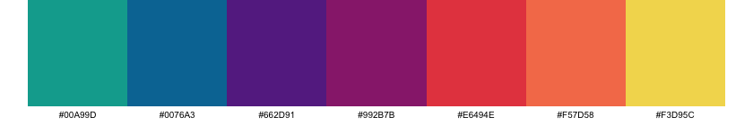<br>

**modern_categorical_05** - A 7-color earthy palette with natural tones

``` r
# Gold Metallic, Lion, Khaki, Cambridge Blue, Peach, Flame, Dim Gray
show_palette("modern_categorical_05")
```

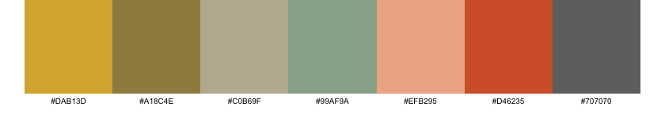<br>

**modern_categorical_06** - A 7-color dynamic palette with high contrast

``` r
# Marian Blue, Xanthous, Copper, Mint, Folly, Deep Sky Blue, Tomato
show_palette("modern_categorical_06")
```

**modern_categorical_07** - A 10-color robust palette with earthy and vibrant tones

``` r
# Cardinal, Davys Gray, Xanthous, Viridian, Asparagus, Lapis Lazuli, Old Gold, Indian Red, Air Force Blue, Emerald
show_palette("modern_categorical_07")
```

**modern_categorical_08** - A 10-color nature-inspired palette with greens and warm accents

``` r
# Dark Pastel Green, Davys Gray, Pumpkin, Pear, Robin Egg Blue, Jungle Green, Pine Green, Moss Green, Blush, Lapis Lazuli
show_palette("modern_categorical_08")
```

**modern_categorical_09** - A 10-color soft pastel palette with gentle tones

``` r
# Champagne Pink, Linen, Misty Rose, Mimi Pink, Light Cyan, Mint Cream, Isabelline, Alice Blue, Columbia Blue, Powder Blue
show_palette("modern_categorical_09")
```

**modern_categorical_10** - A 10-color bright and cheerful palette

``` r
# Jasmine, Yellow Green, Light Sky Blue, Light Red, Lavender Pink, Light Green, Mauve, Atomic Tangerine, Tiffany Blue, Periwinkle
show_palette("modern_categorical_10")
```

**modern_categorical_11** - A 10-color delicate spring palette

``` r
# Cherry Blossom Pink, Uranian Blue, Nyanza, Lavender Blush, Non Photo Blue, Lemon Chiffon, Periwinkle, Pale Dogwood, Nyanza 2, Pale Purple
show_palette("modern_categorical_11")
```

**modern_categorical_12** - A 10-color dreamy pastel palette

``` r
# Columbia Blue, Peach Yellow, Plum Web, Periwinkle, Tea Green, Pale Dogwood, Amaranth Pink, Cherry Blossom Pink, Lilac, Peach
show_palette("modern_categorical_12")
```

**modern_categorical_13** - A 10-color vibrant primary palette

``` r
# Red, Azure, Rose, Yellow, Violet, Green, Cyan RGB, Blue, Fuchsia, Princeton Orange
show_palette("modern_categorical_13")
```

**modern_categorical_14** - A 10-color balanced earth and sky palette

``` r
# Avocado, Jonquil, Lapis Lazuli, Mindaro, Pumpkin, Celestial Blue, Red Violet, Yellow Green, Orange Peel, Murrey
show_palette("modern_categorical_14")
```

**modern_categorical_15** - A 10-color sophisticated earth palette

``` r
# Myrtle Green, Saffron, Persian Green, Sandy Brown, Dark Slate Gray, Burnt Sienna, Olivine, Earth Yellow, Charcoal, Coral
show_palette("modern_categorical_15")
```

### Diverging Palettes

**modern_diverging_01** - A 7-color red-to-blue diverging palette with neutral center

``` r
# Claret to Bittersweet to Cherry Blossom Pink to Honeydew to Non Photo Blue to Cerulean to Berkeley Blue
show_palette("modern_diverging_01")
```

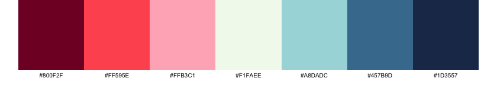<br>

**modern_diverging_02** - A 7-color red-to-green diverging palette through yellow

``` r
# Imperial Red to Orange Crayola to Carrot Orange to Saffron to Pistachio to Zomp to Paynes Gray
show_palette("modern_diverging_02")
```

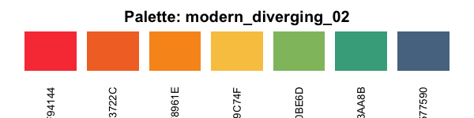<br>

**modern_diverging_03** - A 7-color green-to-orange diverging palette through yellow

``` r
# Charcoal to Myrtle Green to Persian Green to Olivine to Saffron to Sandy Brown to Burnt Sienna
show_palette("modern_diverging_03")
```

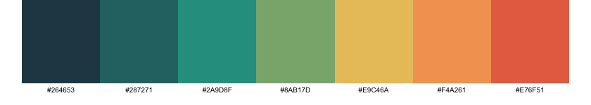<br>

**modern_diverging_04** - A 7-color orange-to-pink diverging palette with neutral center

``` r
# Persimmon to Orange Crayola to Atomic Tangerine to Linen to Baker Miller Pink to Bright Pink Crayola to Cerise
show_palette("modern_diverging_04")
```

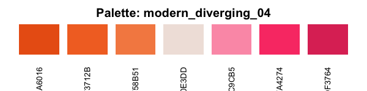<br>

**modern_diverging_05** - A 7-color teal-to-orange diverging palette through vanilla

``` r
# Midnight Green to Dark Cyan to Tiffany Blue to Vanilla to Gamboge to Alloy Orange to Rust
show_palette("modern_diverging_05")
```

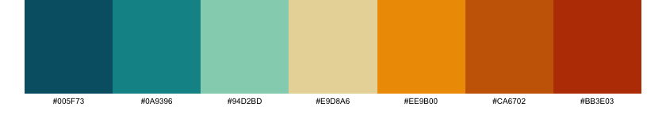<br>

**modern_diverging_06** - A 7-color red-to-magenta diverging palette through white

``` r
# Chili Red to Pumpkin to Atomic Tangerine to White to Sky Magenta to Mulberry to Quinacridone Magenta
show_palette("modern_diverging_06")
```

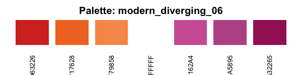<br>

**modern_diverging_07** - A 7-color dark green-to-red diverging palette through blue

``` r
# Dark Green to Pine Green to Keppel to Non Photo Blue to Imperial Red to Fire Engine Red to Madder
show_palette("modern_diverging_07")
```

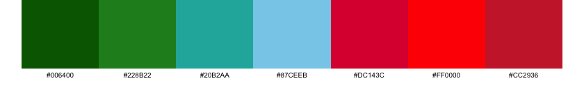<br>

**modern_diverging_08** - A 7-color black-to-red diverging palette through neutrals

``` r
# Smoky Black to Davy's Gray to Silver to White Smoke to Off Red RGB to Engineering Orange to Turkey Red
show_palette("modern_diverging_08")
```

<br>

**modern_diverging_09** - A 7-color blue-to-red diverging palette through platinum

``` r
# Yale Blue to Green Blue to United Nations Blue to Platinum to Tomato to Red CMYK to Turkey Red
show_palette("modern_diverging_09")
```

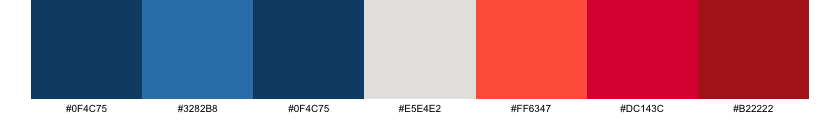<br>

**modern_diverging_10** - A 7-color prussian blue-to-brown diverging palette through neutrals

``` r
# Prussian Blue to Caribbean Current to Cambridge Blue to Papaya Whip to Hunyadi Yellow to Brown to Seal Brown
show_palette("modern_diverging_10")
```

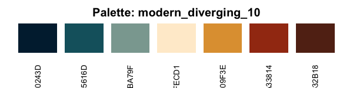<br>

**modern_diverging_11** - A 7-color caribbean-to-tangerine diverging palette through neutrals

``` r
# Caribbean Current to Dark Cyan to Tiffany Blue to Alice Blue to Pale Dogwood to Melon to Atomic Tangerine
show_palette("modern_diverging_11")
```

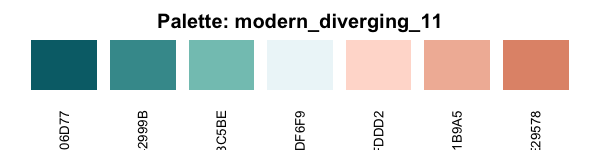<br>

**modern_diverging_12** - A 7-color red-to-grey diverging palette through white

``` r
# Claret to Redwood to Salmon Pink to White to Timberwolf to Pale Dogwood to Paynes Gray
show_palette("modern_diverging_12")
```

**modern_diverging_13** - A 7-color blue-to-green diverging palette through platinum

``` r
# Yale Blue to Green Blue to United Nations Blue to Platinum to Pigment Green to Forest Green to Cal Poly Green
show_palette("modern_diverging_13")
```

**modern_diverging_14** - A 7-color pink-to-cyan diverging palette through white

``` r
# Tea Rose Red to Tea Rose Red 2 to Lavender Blush to Seasalt to Light Cyan to Mint Green to Non Photo Blue
show_palette("modern_diverging_14")
```

**modern_diverging_15** - A 7-color warm-to-cool earth diverging palette

``` r
# Buff to Desert Sand to Champagne Pink to Alabaster to Ash Gray to Sage to Reseda Green
show_palette("modern_diverging_15")
```

**modern_diverging_16** - A 7-color blue-to-red diverging palette through grey

``` r
# Royal Blue Traditional to Cobalt Blue to Blue NCS to Timberwolf to Folly to Cornell Red to Falu Red
show_palette("modern_diverging_16")
```

**modern_diverging_17** - A 7-color red-to-black diverging palette through white

``` r
# Penn Red to Persimmon to Orange Web to White to Silver to Prussian Blue to Black
show_palette("modern_diverging_17")
```

### Sequential Palettes

**modern_sequential_red_01** - A 10-color sequential red palette from dark to light

``` r
# Chocolate Cosmos to Claret to Amaranth Purple to Rose Red to Bright Pink Crayola to Salmon Pink to Cherry Blossom Pink to Pink to Lavender Blush
show_palette("modern_sequential_red_01")
```

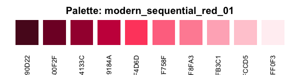<br>

**modern_sequential_red_02** - A 7-color deep red sequential palette

``` r
# Cardinal to Madder to Claret to Claret 2 to Tyrian Purple to Dark Purple to Russian Violet
show_palette("modern_sequential_red_02")
```

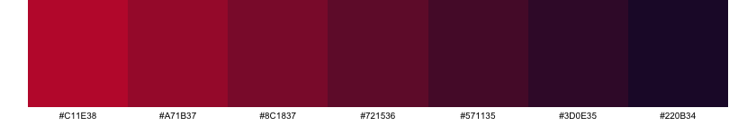<br>

**modern_sequential_red_03** - A 10-color rose sequential palette from dark to light

``` r
# Chocolate Cosmos to Caput Mortuum to Wine to Rose Ebony to Rose Taupe to Rose Taupe 2 to Old Rose to Orchid Pink to Tea Rose Red to Misty Rose
show_palette("modern_sequential_red_03")
```

**modern_sequential_blue_01** - A 10-color sequential blue palette from dark to light

``` r
# Prussian Blue to Indigo Dye to UCLA Blue to Cerulean to Air Force Blue to Air Superiority Blue to Sky Blue to Light Blue
show_palette("modern_sequential_blue_01")
```

<br>

**modern_sequential_blue_02** - A 10-color blue-to-aqua sequential palette

``` r
# Cerulean to Bondi Blue to Moonstone to Robin Egg Blue to Tiffany Blue to Aquamarine
show_palette("modern_sequential_blue_02")
```

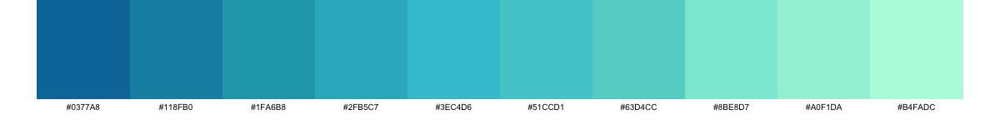<br>

**modern_sequential_blue_03** - A 7-color blue-grey sequential palette from light to dark

``` r
# Platinum to French Gray to Cadet Gray to Slate Gray to Ultra Violet to Delft Blue to Penn Blue
show_palette("modern_sequential_blue_03")
```

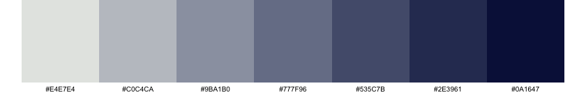<br>

**modern_sequential_blue_04** - A 7-color deep blue sequential palette

``` r
# Federal Blue to Penn Blue to Yale Blue to Lapis Lazuli to Cerulean to Blue Green to Pacific Cyan
show_palette("modern_sequential_blue_04")
```

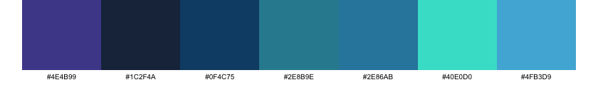<br>

**modern_sequential_blue_05** - A 10-color bright blue sequential palette

``` r
# Picton Blue to Deep Sky Blue to Vivid Sky Blue to Pale Azure to Pale Azure 2 to Uranian Blue to Uranian Blue 2 to Columbia Blue to Columbia Blue 2 to Azure Web
show_palette("modern_sequential_blue_05")
```

**modern_sequential_blue_06** - A 10-color blue sequential palette from light to dark

``` r
# Alice Blue to Columbia Blue to Baby Blue to Sky Blue to Picton Blue to Celestial Blue to Blue NCS to Cerulean to Indigo Dye to Indigo Dye 2
show_palette("modern_sequential_blue_06")
```

**modern_sequential_green_01** - A 10-color green-to-yellow sequential palette

``` r
# Viridian to Sea Green to Kelly Green to Apple Green to Yellow Green to Pear to Yellow
show_palette("modern_sequential_green_01")
```

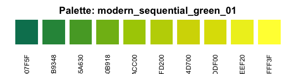<br>

**modern_sequential_green_02** - A 10-color pure green sequential palette

``` r
# Brunswick Green to Castleton Green to Dartmouth Green to Dark Spring Green to Shamrock Green to Mint to Aquamarine to Celadon to Honeydew to Mint Cream
show_palette("modern_sequential_green_02")
```

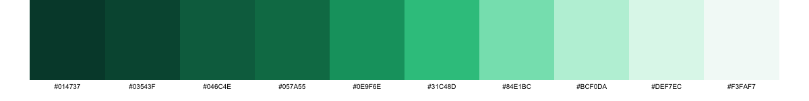<br>

**modern_sequential_green_03** - A 10-color natural green sequential palette

``` r
# Dark Green to Cal Poly Green to Fern Green to Asparagus to Mantis to Olivine to Celadon to Tea Green to Honeydew
show_palette("modern_sequential_green_03")
```

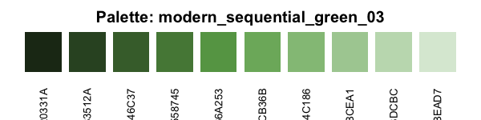<br>

**modern_sequential_green_04** - A 10-color teal sequential palette

``` r
# Azure Web to Tiffany Blue to Tiffany Blue 2 to Verdigris to Persian Green to Persian Green 2 to Dark Cyan to Pine Green to Pine Green 2 to Brunswick Green
show_palette("modern_sequential_green_04")
```

**modern_sequential_green_05** - A 10-color forest green sequential palette

``` r
# Brunswick Green to Brunswick Green 2 to Hookers Green to Hookers Green 2 to Viridian to Zomp to Cambridge Blue to Cambridge Blue 2 to Tiffany Blue to Aquamarine
show_palette("modern_sequential_green_05")
```

**modern_sequential_green_06** - A 10-color olive green sequential palette

``` r
# Black Olive to Reseda Green to Moss Green to Olivine to Pistachio to Tea Green to Tea Green 2 to Nyanza to Nyanza 2 to Ivory
show_palette("modern_sequential_green_06")
```

**modern_sequential_yellow_01** - A 10-color orange-to-yellow sequential palette

``` r
# Safety Orange to Dark Orange Web to Princeton Orange to Orange Peel to Orange Web to Selective Yellow to Mikado Yellow to Jonquil to School Bus Yellow to Naples Yellow
show_palette("modern_sequential_yellow_01")
```

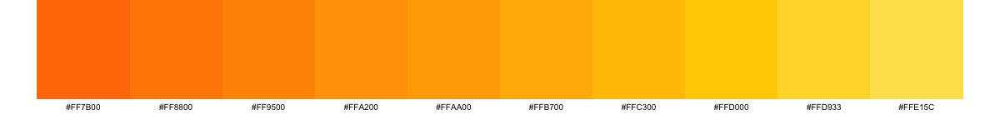<br>

**modern_sequential_yellow_02** - A 10-color gold sequential palette

``` r
# Satin Sheen Gold to Gold Metallic to Gold Metallic 2 to Old Gold to Old Gold 2 to Citron to Flax to Vanilla to Vanilla 2 to Lemon Chiffon
show_palette("modern_sequential_yellow_02")
```

**modern_sequential_grey_01** - A 10-color grey sequential palette from dark to light

``` r
# Dim Gray to Gray to Battleship Gray to Taupe Gray to Silver to Timberwolf to Isabelline
show_palette("modern_sequential_grey_01")
```

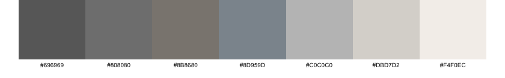<br>

**modern_sequential_grey_02** - A 10-color neutral grey sequential palette

``` r
# Seasalt to Antiflash White to Platinum to French Gray to French Gray 2 to Cadet Gray to Slate Gray to Outer Space to Onyx to Eerie Black
show_palette("modern_sequential_grey_02")
```

**modern_sequential_grey_03** - A 10-color warm grey sequential palette

``` r
# Seasalt to Timberwolf to Dun to Khaki to Beaver to Raw Umber to Umber to Van Dyke to Bistre to Licorice
show_palette("modern_sequential_grey_03")
```

**modern_sequential_grey_04** - A 10-color brown sequential palette

``` r
# Bistre to Cafe Noir to Kobicha to Coyote to Lion to Lion 2 to Buff to Desert Sand to Light Orange to Wheat
show_palette("modern_sequential_grey_04")
```

**modern_sequential_grey_05** - A 10-color light grey sequential palette

``` r
# White to White Smoke to Antiflash White to Platinum to Timberwolf to Silver to Silver 2 to Silver 3 to Silver 4 to Silver 5
show_palette("modern_sequential_grey_05")
```

**modern_sequential_grey_06** - A 10-color dark grey sequential palette

``` r
# Night to Eerie Black to Jet to Davys Gray to Dim Gray to Battleship Gray to Silver to Silver 2 to Platinum to White Smoke
show_palette("modern_sequential_grey_06")
```

**modern_sequential_grey_07** - A 10-color warm neutral sequential palette

``` r
# Timberwolf to Timberwolf 2 to Dun to Dun 2 to Khaki to Khaki 2 to Khaki 3 to Khaki 4 to Cinereous to Beaver
show_palette("modern_sequential_grey_07")
```

**modern_sequential_grey_08** - A 10-color beige sequential palette

``` r
# Linen to Bone to Almond to Almond 2 to Dun to Dun 2 to Dun 3 to Dun 4 to Khaki to Khaki 2
show_palette("modern_sequential_grey_08")
```

**modern_sequential_cyan_01** - A 7-color cyan-to-white sequential palette

``` r
# Jet to Dark Cyan to Robin Egg Blue to Electric Blue to Platinum to Antiflash White to White
show_palette("modern_sequential_cyan_01")
```

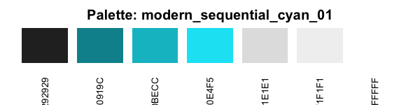<br>

**modern_sequential_cyan_02** - A 10-color teal sequential palette

``` r
# Teal to Teal 2 to Dark Cyan to Dark Cyan 2 to Verdigris to Verdigris 2 to Verdigris 3 to Tiffany Blue to Light Blue to Light Blue 2
show_palette("modern_sequential_cyan_02")
```

**modern_sequential_coral_01** - A 7-color warm coral sequential palette

``` r
# Cornsilk to Desert Sand to Melon to Old Rose to Blush to Rose Red to Amaranth Purple
show_palette("modern_sequential_coral_01")
```

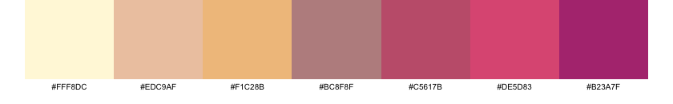<br>

**modern_sequential_coral_02** - A 10-color orange coral sequential palette

``` r
# Seashell to Pale Dogwood to Apricot to Peach to Atomic Tangerine to Atomic Tangerine 2 to Coral to Orange Crayola to Orange Pantone to Orange Pantone 2
show_palette("modern_sequential_coral_02")
```

**modern_sequential_coral_03** - A 10-color green coral sequential palette

``` r
# Brunswick Green to Brunswick Green 2 to Pine Green to Persian Green to Keppel to Keppel 2 to Turquoise to Tiffany Blue to Mint Green to Azure Web
show_palette("modern_sequential_coral_03")
```

**modern_sequential_pink_01** - A 7-color pink-grey sequential palette

``` r
# Paynes Gray to Dim Gray to Mountbatten Pink to Old Rose to Old Rose 2 to Light Coral to Coral Pink
show_palette("modern_sequential_pink_01")
```

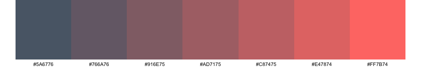<br>

**modern_sequential_pink_02** - A 10-color deep pink sequential palette

``` r
# Eggplant to Wine to Claret to Claret 2 to Rose Red to Blush to Rose Pompadour to Amaranth Pink to Orchid Pink to Mimi Pink
show_palette("modern_sequential_pink_02")
```

**modern_sequential_pink_03** - A 10-color magenta sequential palette

``` r
# Tyrian Purple to Wine to Quinacridone Magenta to Quinacridone Magenta 2 to Raspberry Rose to Fuchsia Rose to Fuchsia Rose 2 to Thulian Pink to Amaranth Pink to Orchid Pink
show_palette("modern_sequential_pink_03")
```

## Usage Examples

### Categorical Data Visualization

``` r
library(MoreColours)
library(ggplot2)

# Scatter plot with species grouping
ggplot(iris, aes(x = Sepal.Length, y = Sepal.Width, color = Species)) +
  geom_point(size = 3) +
  scale_color_manual(values = get_palette("modern_categorical_01")) +
  theme_minimal() +
  labs(title = "Iris Dataset with Modern Categorical Palette")

# Bar chart with multiple categories
ggplot(mtcars, aes(x = factor(cyl), fill = factor(gear))) +
  geom_bar(position = "dodge") +
  scale_fill_manual(values = get_palette("modern_categorical_02")) +
  theme_minimal() +
  labs(title = "Car Data", x = "Cylinders", fill = "Gears")
```

### Diverging Data Visualization

``` r
# Correlation matrix heatmap using base R
cor_matrix <- cor(mtcars)
heatmap(cor_matrix, 
        col = get_palette("modern_diverging_01", n = 11, type = "continuous"),
        main = "Correlation Matrix with Diverging Colors")
```

``` r
# Correlation heatmap using ggplot2
library(ggplot2)

# Create correlation matrix and convert to long format (base R method)
cor_matrix <- cor(mtcars)
cor_data <- expand.grid(Var1 = rownames(cor_matrix), Var2 = colnames(cor_matrix))
cor_data$value <- as.vector(cor_matrix)

# Create the heatmap
ggplot(cor_data, aes(x = Var1, y = Var2, fill = value)) +
  geom_tile() +
  scale_fill_gradientn(colors = get_palette("modern_diverging_02", n = 11, type = "continuous"),
                       limits = c(-1, 1)) +
  theme_minimal() +
  theme(axis.text.x = element_text(angle = 45, hjust = 1)) +
  labs(title = "Correlation Heatmap with Diverging Palette")
```

### Sequential Data Visualization

``` r
# Density plot with sequential colors
ggplot(faithful, aes(x = eruptions, y = waiting)) +
  stat_density_2d_filled(bins = 10) +
  scale_fill_manual(values = get_palette("modern_sequential_blue_01", n = 10)) +
  theme_minimal() +
  labs(title = "Old Faithful Eruptions")

# Surface plot using volcano data
volcano_data <- expand.grid(x = 1:nrow(volcano), y = 1:ncol(volcano))  # Create grid
volcano_data$z <- as.vector(volcano)  # Add elevation values

ggplot(volcano_data, aes(x = x, y = y, fill = z)) +
  geom_tile() +
  scale_fill_gradientn(colors = get_palette("modern_sequential_green_02", n = 20, type = "continuous")) +
  theme_void() +
  labs(title = "Volcano Elevation Map", fill = "Elevation")
```

## Advanced Features

### Color Manipulation

``` r
# Get more colors through interpolation
smooth_gradient <- get_palette("modern_sequential_blue_01", n = 50, type = "continuous")

# Add transparency
transparent_colors <- get_palette("modern_categorical_01", alpha = 0.7)

# Reverse palette order
reversed_palette <- get_palette("modern_diverging_01", reverse = TRUE)

# Get subset of colors
first_three <- get_palette("modern_categorical_02", n = 3)
```

### Creating Palette Documentation

``` r
# Generate PNG files for all palettes
generate_all_pngs()

# Generate with custom settings
generate_all_pngs(output_dir = "assets", width = 100, height = 100)
```

### Integration with Other Packages

``` r
# Works with any package that accepts color vectors
# Base R plotting
plot(1:10, col = get_palette("modern_categorical_01", n = 10))

# lattice
library(lattice)
xyplot(Sepal.Length ~ Sepal.Width, data = iris, groups = Species,
       par.settings = list(superpose.symbol = list(col = get_palette("modern_categorical_01"))))

# plotly (if installed)
# library(plotly)
# plot_ly(iris, x = ~Sepal.Length, y = ~Sepal.Width, color = ~Species,
#         colors = get_palette("modern_categorical_01"))
```

## Package Development

### Building and Testing

``` r
# Generate documentation
devtools::document()

# Check package
devtools::check()

# Build package
devtools::build()

# Install locally
devtools::install()
```

### Adding New Palettes

To add new palettes, edit the `palettes_list` in `R/palettes.R`:

``` r
palettes_list <- list(
  # Existing palettes...
  
  # Your new palette
  my_new_palette = c(
    "#COLOR1",  # Color Name 1
    "#COLOR2",  # Color Name 2
    "#COLOR3"   # Color Name 3
  )
)
```

## License

This package is released under the MIT License.

## Contributing

Contributions are welcome! Please feel free to submit pull requests or open issues for bug reports and feature requests.
