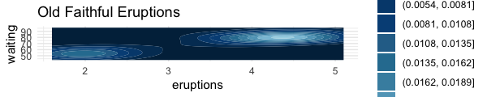
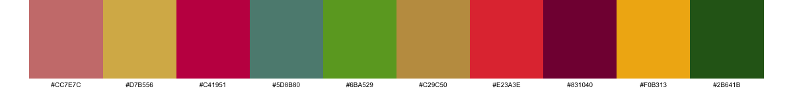
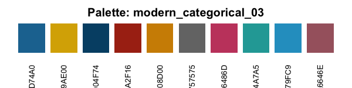

<br>
<br>

# MoreColours

A professional R package providing curated color palettes for data visualization.

## Installation

``` r
# Install from GitHub (once uploaded)
devtools::install_github("thomassie/MoreColours")

# Or install locally
devtools::install()
```

## Quick Start

``` r
library(MoreColours)

# List available palettes
list_palettes()

# Get a palette
colors <- get_palette("modern_categorical_01")

# Show palette visually
show_palette("modern_categorical_01")

# Use with ggplot2
library(ggplot2)
ggplot(iris, aes(x = Sepal.Length, y = Sepal.Width, color = Species)) +
  geom_point() +
  scale_color_manual(values = get_palette("modern_categorical_01"))
```

## Available Palettes

### Categorical Palettes

**modern_categorical_01** - A 5-color palette optimized for categorical data

``` r
# Steel Blue, Berry, Orange, Red, Green
show_palette("modern_categorical_01")
```
<br>

**modern_categorical_02** - A 10-color extended palette with rich, earthy tones

``` r
# Old Rose, Gold, Rose Red, Viridian, Kelly Green, Satin Sheen Gold, Poppy, Murray, Xanthous, Dark Moss Green
show_palette("modern_categorical_02")
```
<br>

**modern_categorical_03** - A 10-color cool-toned palette with blues and warm accents

``` r
# Cerulean, Gold, Indigo Dye, Rufous, Harvest Gold, Grey, Fuchsia Rose, Light Sea Green, Blue Green, Rose Taupe
show_palette("modern_categorical_03")
```
<br>

**modern_categorical_04** - A 7-color vibrant palette with bold colors

``` r
# Persian Green, Cerulean, Rebecca Purple, Plum, Imperial Red, Coral, Naples Yellow
show_palette("modern_categorical_04")
```

**modern_categorical_05** - A 7-color earthy palette with natural tones

``` r
# Gold Metallic, Lion, Khaki, Cambridge Blue, Peach, Flame, Dim Gray
show_palette("modern_categorical_05")
```

**modern_categorical_06** - A 7-color dynamic palette with high contrast

``` r
# Marian Blue, Xanthous, Copper, Mint, Folly, Deep Sky Blue, Tomato
show_palette("modern_categorical_06")
```

### Diverging Palettes

**modern_diverging_01** - A 7-color red-to-blue diverging palette with neutral center

``` r
# Claret to Bittersweet to Cherry Blossom Pink to Honeydew to Non Photo Blue to Cerulean to Berkeley Blue
show_palette("modern_diverging_01")
```

**modern_diverging_02** - A 7-color red-to-green diverging palette through yellow

``` r
# Imperial Red to Orange Crayola to Carrot Orange to Saffron to Pistachio to Zomp to Paynes Gray
show_palette("modern_diverging_02")
```

**modern_diverging_03** - A 7-color green-to-orange diverging palette through yellow

``` r
# Charcoal to Myrtle Green to Persian Green to Olivine to Saffron to Sandy Brown to Burnt Sienna
show_palette("modern_diverging_03")
```

**modern_diverging_04** - A 7-color orange-to-pink diverging palette with neutral center

``` r
# Persimmon to Orange Crayola to Atomic Tangerine to Linen to Baker Miller Pink to Bright Pink Crayola to Cerise
show_palette("modern_diverging_04")
```

**modern_diverging_05** - A 7-color teal-to-orange diverging palette through vanilla

``` r
# Midnight Green to Dark Cyan to Tiffany Blue to Vanilla to Gamboge to Alloy Orange to Rust
show_palette("modern_diverging_05")
```

**modern_diverging_06** - A 7-color red-to-magenta diverging palette through white

``` r
# Chili Red to Pumpkin to Atomic Tangerine to White to Sky Magenta to Mulberry to Quinacridone Magenta
show_palette("modern_diverging_06")
```

**modern_diverging_07** - A 7-color dark green-to-red diverging palette through blue

``` r
# Dark Green to Pine Green to Keppel to Non Photo Blue to Imperial Red to Fire Engine Red to Madder
show_palette("modern_diverging_07")
```

**modern_diverging_08** - A 7-color black-to-red diverging palette through neutrals

``` r
# Smoky Black to Davy's Gray to Silver to White Smoke to Off Red RGB to Engineering Orange to Turkey Red
show_palette("modern_diverging_08")
```

**modern_diverging_09** - A 7-color blue-to-red diverging palette through platinum

``` r
# Yale Blue to Green Blue to United Nations Blue to Platinum to Tomato to Red CMYK to Turkey Red
show_palette("modern_diverging_09")
```

**modern_diverging_10** - A 7-color prussian blue-to-brown diverging palette through neutrals

``` r
# Prussian Blue to Caribbean Current to Cambridge Blue to Papaya Whip to Hunyadi Yellow to Brown to Seal Brown
show_palette("modern_diverging_10")
```

**modern_diverging_11** - A 7-color caribbean-to-tangerine diverging palette through neutrals

``` r
# Caribbean Current to Dark Cyan to Tiffany Blue to Alice Blue to Pale Dogwood to Melon to Atomic Tangerine
show_palette("modern_diverging_11")
```

### Sequential Palettes

**modern_sequential_red_01** - A 10-color sequential red palette from dark to light

``` r
# Chocolate Cosmos to Claret to Amaranth Purple to Rose Red to Bright Pink Crayola to Salmon Pink to Cherry Blossom Pink to Pink to Lavender Blush
show_palette("modern_sequential_red_01")
```

**modern_sequential_blue_01** - A 10-color sequential blue palette from dark to light

``` r
# Prussian Blue to Indigo Dye to UCLA Blue to Cerulean to Air Force Blue to Air Superiority Blue to Sky Blue to Light Blue
show_palette("modern_sequential_blue_01")
```

**modern_sequential_blue_02** - A 10-color blue-to-aqua sequential palette

``` r
# Cerulean to Bondi Blue to Moonstone to Robin Egg Blue to Tiffany Blue to Aquamarine
show_palette("modern_sequential_blue_02")
```

**modern_sequential_green_01** - A 10-color green-to-yellow sequential palette

``` r
# Viridian to Sea Green to Kelly Green to Apple Green to Yellow Green to Pear to Yellow
show_palette("modern_sequential_green_01")
```

**modern_sequential_green_02** - A 10-color pure green sequential palette

``` r
# Brunswick Green to Castleton Green to Dartmouth Green to Dark Spring Green to Shamrock Green to Mint to Aquamarine to Celadon to Honeydew to Mint Cream
show_palette("modern_sequential_green_02")
```

**modern_sequential_green_03** - A 10-color natural green sequential palette

``` r
# Dark Green to Cal Poly Green to Fern Green to Asparagus to Mantis to Olivine to Celadon to Tea Green to Honeydew
show_palette("modern_sequential_green_03")
```

**modern_sequential_yellow_01** - A 10-color orange-to-yellow sequential palette

``` r
# Safety Orange to Dark Orange Web to Princeton Orange to Orange Peel to Orange Web to Selective Yellow to Mikado Yellow to Jonquil to School Bus Yellow to Naples Yellow
show_palette("modern_sequential_yellow_01")
```

**modern_sequential_grey_01** - A 10-color grey sequential palette from dark to light

``` r
# Dim Gray to Gray to Battleship Gray to Taupe Gray to Silver to Timberwolf to Isabelline
show_palette("modern_sequential_grey_01")
```

**modern_sequential_cyan_01** - A 7-color cyan-to-white sequential palette

``` r
# Jet to Dark Cyan to Robin Egg Blue to Electric Blue to Platinum to Antiflash White to White
show_palette("modern_sequential_cyan_01")
```

**modern_sequential_blue_03** - A 7-color blue-grey sequential palette from light to dark

``` r
# Platinum to French Gray to Cadet Gray to Slate Gray to Ultra Violet to Delft Blue to Penn Blue
show_palette("modern_sequential_blue_03")
```

**modern_sequential_blue_04** - A 7-color deep blue sequential palette

``` r
# Federal Blue to Penn Blue to Yale Blue to Lapis Lazuli to Cerulean to Blue Green to Pacific Cyan
show_palette("modern_sequential_blue_04")
```

**modern_sequential_coral_01** - A 7-color warm coral sequential palette

``` r
# Cornsilk to Desert Sand to Melon to Old Rose to Blush to Rose Red to Amaranth Purple
show_palette("modern_sequential_coral_01")
```

**modern_sequential_pink_01** - A 7-color pink-grey sequential palette

``` r
# Paynes Gray to Dim Gray to Mountbatten Pink to Old Rose to Old Rose 2 to Light Coral to Coral Pink
show_palette("modern_sequential_pink_01")
```

**modern_sequential_red_02** - A 7-color deep red sequential palette

``` r
# Cardinal to Madder to Claret to Claret 2 to Tyrian Purple to Dark Purple to Russian Violet
show_palette("modern_sequential_red_02")
```

## Usage Examples

### Categorical Data Visualization

``` r
library(MoreColours)
library(ggplot2)

# Scatter plot with species grouping
ggplot(iris, aes(x = Sepal.Length, y = Sepal.Width, color = Species)) +
  geom_point(size = 3) +
  scale_color_manual(values = get_palette("modern_categorical_01")) +
  theme_minimal() +
  labs(title = "Iris Dataset with Modern Categorical Palette")

# Bar chart with multiple categories
ggplot(mtcars, aes(x = factor(cyl), fill = factor(gear))) +
  geom_bar(position = "dodge") +
  scale_fill_manual(values = get_palette("modern_categorical_02")) +
  theme_minimal() +
  labs(title = "Car Data", x = "Cylinders", fill = "Gears")
```

### Diverging Data Visualization

``` r
# Correlation matrix heatmap using base R
cor_matrix <- cor(mtcars)
heatmap(cor_matrix, 
        col = get_palette("modern_diverging_01", n = 11, type = "continuous"),
        main = "Correlation Matrix with Diverging Colors")
```

``` r
# Correlation heatmap using ggplot2
library(ggplot2)

# Create correlation matrix and convert to long format (base R method)
cor_matrix <- cor(mtcars)
cor_data <- expand.grid(Var1 = rownames(cor_matrix), Var2 = colnames(cor_matrix))
cor_data$value <- as.vector(cor_matrix)

# Create the heatmap
ggplot(cor_data, aes(x = Var1, y = Var2, fill = value)) +
  geom_tile() +
  scale_fill_gradientn(colors = get_palette("modern_diverging_02", n = 11, type = "continuous"),
                       limits = c(-1, 1)) +
  theme_minimal() +
  theme(axis.text.x = element_text(angle = 45, hjust = 1)) +
  labs(title = "Correlation Heatmap with Diverging Palette")
```

### Sequential Data Visualization

``` r
# Density plot with sequential colors
ggplot(faithful, aes(x = eruptions, y = waiting)) +
  stat_density_2d_filled(bins = 10) +
  scale_fill_manual(values = get_palette("modern_sequential_blue_01", n = 10)) +
  theme_minimal() +
  labs(title = "Old Faithful Eruptions")

# Surface plot using volcano data
volcano_data <- expand.grid(x = 1:nrow(volcano), y = 1:ncol(volcano))  # Create grid
volcano_data$z <- as.vector(volcano)  # Add elevation values

ggplot(volcano_data, aes(x = x, y = y, fill = z)) +
  geom_tile() +
  scale_fill_gradientn(colors = get_palette("modern_sequential_green_02", n = 20, type = "continuous")) +
  theme_void() +
  labs(title = "Volcano Elevation Map", fill = "Elevation")
```

## Advanced Features

### Color Manipulation

``` r
# Get more colors through interpolation
smooth_gradient <- get_palette("modern_sequential_blue_01", n = 50, type = "continuous")

# Add transparency
transparent_colors <- get_palette("modern_categorical_01", alpha = 0.7)

# Reverse palette order
reversed_palette <- get_palette("modern_diverging_01", reverse = TRUE)

# Get subset of colors
first_three <- get_palette("modern_categorical_02", n = 3)
```

### Creating Palette Documentation

``` r
# Generate PNG files for all palettes

for(palette_name in list_palettes()) {
  colors <- get_palette(palette_name)
  n_colors <- length(colors)
  
  # Calculate width: square size (120px) * number of colors
  square_size <- 120
  png_width <- square_size * n_colors
  
  png(paste0("assets/", palette_name, ".png"), 
      width = png_width, height = square_size + 30, res = 100)  # +30 for text space
  
  # Clean version - no title, horizontal codes, smaller text
  par(mar = c(1.5, 0, 0, 0))
  barplot(rep(1, n_colors), 
          col = colors, 
          border = NA, 
          axes = FALSE,
          main = "",
          width = 1,        # Each bar has width 1
          space = 0)        # No space between bars = perfect squares
  
  # Add horizontal hex codes below
  text(seq(0.5, by = 1, length.out = n_colors), -0.05, 
       colors, 
       srt = 0,           # horizontal text
       adj = c(0.5, 1),   # centered, top-aligned
       xpd = TRUE, 
       cex = 0.6)         # smaller text
  
  dev.off()
}
```

### Integration with Other Packages

``` r
# Works with any package that accepts color vectors
# Base R plotting
plot(1:10, col = get_palette("modern_categorical_01", n = 10))

# lattice
library(lattice)
xyplot(Sepal.Length ~ Sepal.Width, data = iris, groups = Species,
       par.settings = list(superpose.symbol = list(col = get_palette("modern_categorical_01"))))

# plotly (if installed)
# library(plotly)
# plot_ly(iris, x = ~Sepal.Length, y = ~Sepal.Width, color = ~Species,
#         colors = get_palette("modern_categorical_01"))
```

## Package Development

### Building and Testing

``` r
# Generate documentation
devtools::document()

# Check package
devtools::check()

# Build package
devtools::build()

# Install locally
devtools::install()
```

### Adding New Palettes

To add new palettes, edit the `palettes_list` in `R/palettes.R`:

``` r
palettes_list <- list(
  # Existing palettes...
  
  # Your new palette
  my_new_palette = c(
    "#COLOR1",  # Color Name 1
    "#COLOR2",  # Color Name 2
    "#COLOR3"   # Color Name 3
  )
)
```

## License

This package is released under the MIT License.

## Contributing

Contributions are welcome! Please feel free to submit pull requests or open issues for bug reports and feature requests.
