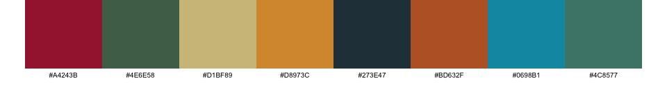
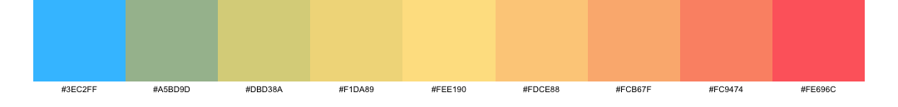

<br>
<br>

# MoreColours

A professional R package providing curated color palettes for data visualization.

## Installation

``` r
# Install from GitHub (once uploaded)
devtools::install_github("thomassie/MoreColours")

# Or install locally
devtools::install()
```

## Quick Start

``` r
library(MoreColours)

# List available palettes
list_palettes()

# Get a palette
colors <- get_palette("more_categorical_01")

# Show palette visually
show_palette("more_categorical_01")

# Use with ggplot2
library(ggplot2)
ggplot(iris, aes(x = Sepal.Length, y = Sepal.Width, color = Species)) +
  geom_point() +
  scale_color_manual(values = get_palette("more_categorical_01"))
```

## Available Palettes

### Categorical Palettes (21 palettes)

**more_categorical_01**

``` r
# Steel Blue to Berry to Orange to Red to Green
show_palette("more_categorical_01")
```
<br>

**more_categorical_02**

``` r
# Old Rose to Gold to Rose Red to Viridian to Kelly Green to Satin Sheen Gold to Poppy to Murray to Xanthous to Dark Moss Green
show_palette("more_categorical_02")
```
<br>

**more_categorical_03**

``` r
# Champagne Pink to Linen to Misty Rose to Mimi Pink to Light Cyan to Mint Cream to Isabelline to Alice Blue to Columbia Blue to Powder Blue
show_palette("more_categorical_03")
```
<br>

**more_categorical_04**

``` r
# Persian Green to Cerulean to Rebecca Purple to Plum to Imperial Red to Coral to Naples Yellow
show_palette("more_categorical_04")
```
<br>

**more_categorical_05**

``` r
# Gold Metallic to Lion to Khaki to Cambridge Blue to Peach to Flame to Dim Gray
show_palette("more_categorical_05")
```
<br>

**more_categorical_06**

``` r
# Marian Blue to Xanthous to Copper to Mint to Folly to Deep Sky Blue to Tomato
show_palette("more_categorical_06")
```
<br>

**more_categorical_07**

``` r
# Cardinal to Davys Gray to Xanthous to Viridian to Asparagus to Lapis Lazuli to Old Gold to Indian Red to Air Force Blue to Emerald
show_palette("more_categorical_07")
```
<br>

**more_categorical_08**

``` r
# Dark Pastel Green to Davys Gray to Pumpkin to Pear to Robin Egg Blue to Jungle Green to Pine Green to Moss Green to Blush to Lapis Lazuli
show_palette("more_categorical_08")
```
<br>

**more_categorical_09**

``` r
# Champagne Pink to Linen to Misty Rose to Mimi Pink to Light Cyan to Mint Cream to Isabelline to Alice Blue to Columbia Blue to Powder Blue
show_palette("more_categorical_09")
```
<br>

**more_categorical_10**

``` r
# Jasmine to Yellow Green to Light Sky Blue to Light Red to Lavender Pink to Light Green to Mauve to Atomic Tangerine to Tiffany Blue to Periwinkle
show_palette("more_categorical_10")
```
<br>

**more_categorical_11**

``` r
# Cherry Blossom Pink to Uranian Blue to Nyanza to Lavender Blush to Non Photo Blue to Lemon Chiffon to Periwinkle to Pale Dogwood to Nyanza 2 to Pale Purple
show_palette("more_categorical_11")
```
<br>

**more_categorical_12**

``` r
# Columbia Blue to Peach Yellow to Plum Web to Periwinkle to Tea Green to Pale Dogwood to Amaranth Pink to Cherry Blossom Pink to Lilac to Peach
show_palette("more_categorical_12")
```
<br>

**more_categorical_13**

``` r
# Red to Azure to Rose to Yellow to Violet to Green to Cyan RGB to Blue to Fuchsia to Princeton Orange
show_palette("more_categorical_13")
```
<br>

**more_categorical_14**

``` r
# Avocado to Jonquil to Lapis Lazuli to Mindaro to Pumpkin to Celestial Blue to Red Violet to Yellow Green to Orange Peel to Murrey
show_palette("more_categorical_14")
```
<br>

**more_categorical_15**

``` r
# Myrtle Green to Saffron to Persian Green to Sandy Brown to Dark Slate Gray to Burnt Sienna to Olivine to Earth Yellow to Charcoal to Coral
show_palette("more_categorical_15")
```
<br>

**more_categorical_16**

``` r
# Vermilion to Verdigris to Aureolin to Razzle Dazzle Rose to Sgbus Green to Safety Orange to Neon Blue to Rose to Erin
show_palette("more_categorical16")
```
<br>

**more_categorical_17**

``` r
# Old Gold to Delft Blue to Sea Green to Cordovan to Dark Moss Green to Violet JTC to Caput Mortuum to Kelly Green to Drab Dark Brown
show_palette("more_categorical_17")
```
<br>

**more_categorical_18**

``` r
# Paynes Gray to Citron to Carrot Orange to Feldgrau to Old Rose to Moss Green to Old Gold to Viridian to Moss Green 2 to Olivine
show_palette("more_categorical_18")
```
<br>

**more_categorical_19**

``` r
# Cardinal to Davys Gray to Xanthous to Viridian to Asparagus to Lapis Lazuli to Old Gold to Indian Red to Air Force Blue to Emerald
show_palette("more_categorical_19")
```
<br>

**more_categorical_20**

``` r
# Periwinkle to Tea Green to Dutch White to Ash Gray to Pale Dogwood to Lemon Chiffon to Tea Green 2 to French Gray
show_palette("more_categorical_20")
```
<br>

**more_categorical_21**

``` r
# Amaranth Purple to Hookers Green to Ecru to Butterscotch to Charcoal to Alloy Orange to Blue Munsell to Viridian
show_palette("more_categorical_21")
```
<br>

### Diverging Palettes (24 palettes)

**more_diverging_01**

``` r
# Claret to Bittersweet to Cherry Blossom Pink to Honeydew to Non Photo Blue to Cerulean to Berkeley Blue
show_palette("more_diverging_01")
```
<br>

**more_diverging_02**

``` r
# Imperial Red to Orange Crayola to Carrot Orange to Saffron to Moss Green to Zomp to Paynes Gray
show_palette("more_diverging_02")
```
<br>

**more_diverging_03**

``` r
# Charcoal to Myrtle Green to Persian Green to Olivine to Saffron to Sandy Brown to Burnt Sienna
show_palette("more_diverging_03")
```
<br>

**more_diverging_04**

``` r
# Persimmon to Orange Crayola to Atomic Tangerine to Linen to Baker Miller Pink to Bright Pink Crayola to Cerise
show_palette("more_diverging_04")
```
<br>

**more_diverging_05**

``` r
# Midnight Green to Dark Cyan to Tiffany Blue to Vanilla to Gamboge to Alloy Orange to Rust
show_palette("more_diverging_05")
```
<br>

**more_diverging_06**

``` r
# Chili Red to Pumpkin to Atomic Tangerine to White to Sky Magenta to Mulberry to Palatinate
show_palette("more_diverging_06")
```
<br>

**more_diverging_07**

``` r
# Dark Green to Pine Green to Keppel to Non Photo Blue to Fire Engine Red to Imperial Red to Madder
show_palette("more_diverging_07")
```
<br>

**more_diverging_08**

``` r
# Smoky Black to Davy's Gray to Silver to White Smoke to Engineering Orange to Turkey Red to Off Red RGB
show_palette("more_diverging_08")
```
<br>

**more_diverging_09**

``` r
# Indigo Dye to United Nations Blue to Green Blue to Platinum to Tomato to Red CMYK to Carmine
show_palette("more_diverging_09")
```
<br>

**more_diverging_10**

``` r
# Prussian Blue to Cambridge Blue to Caribbean Current to Papaya Whip to Hunyadi Yellow to Brown to Seal Brown
show_palette("more_diverging_10")
```
<br>

**more_diverging_11**

``` r
# Caribbean Current to Dark Cyan to Tiffany Blue to Alice Blue to Pale Dogwood to Melon to Atomic Tangerine
show_palette("more_diverging_11")
```
<br>

**more_diverging_12**

``` r
# Claret to Redwood to Salmon Pink to White to Timberwolf to Pale Dogwood to Paynes Gray
show_palette("more_diverging_12")
```
<br>

**more_diverging_13**

``` r
# Yale Blue to Green Blue to United Nations Blue to Platinum to Pigment Green to Forest Green to Cal Poly Green
show_palette("more_diverging_13")
```
<br>

**more_diverging_14**

``` r
# Tea Rose Red to Tea Rose Red 2 to Lavender Blush to Seasalt to Mint Green to Light Cyan to Non Photo Blue
show_palette("more_diverging_14")
```
<br>

**more_diverging_15**

``` r
# Buff to Desert Sand to Champagne Pink to Alabaster to Ash Gray to Sage to Reseda Green
show_palette("more_diverging_15")
```
<br>

**more_diverging_16**

``` r
# Royal Blue Traditional to Cobalt Blue to Blue NCS to Timberwolf to Folly to Cornell Red to Falu Red
show_palette("more_diverging_16")
```
<br>

**more_diverging_17**

``` r
# Penn Red to Persimmon to Orange Web to White to Silver to Prussian Blue to Black
show_palette("more_diverging_17")
```
<br>

**more_diverging_18**

``` r
# Tea Rose Red to Tea Rose Red 2 to Lavender Blush to Seasalt to Light Cyan to Mint Green to Non Photo Blue
show_palette("more_diverging_18")
```
<br>

**more_diverging_19**

``` r
# Yinmn Blue to Air Force Blue to Air Superiority Blue to Columbia Blue to Lemon Chiffon to Mimi Pink to Persian Pink to French Rose to Amaranth Purple
show_palette("more_diverging_19")
```
<br>

**more_diverging_20**

``` r
# Yale Blue to Paynes Gray to Cadet Gray to Ash Gray to Lemon Chiffon to Mimi Pink to Persian Pink to French Rose to Amaranth Purple
show_palette("more_diverging_20")
```
<br>

**more_diverging_21**

``` r
# Yale Blue to Paynes Gray to Cadet Gray to Ash Gray to Lemon Chiffon to Flax to Naples Yellow to Orange Crayola to Sinopia
show_palette("more_diverging_21")
```
<br>

**more_diverging_22**

``` r
# Prussian Blue to Hunter Green to Olive to Satin Sheen Gold to Selective Yellow to Carrot Orange to Tawny to Rust to Turkey Red
show_palette("more_diverging_22")
```
<br>

**more_diverging_23**

``` r
# Deep Sky Blue to Cambridge Blue to Flax to Flax 2 to Jasmine to Sunset to Fawn to Atomic Tangerine to Light Red
show_palette("more_diverging_23")
```
<br>

**more_diverging_24**

``` r
# French Rose to Cool Gray to Sky Blue to Non Photo Blue to Electric Blue to Ice Blue to Aquamarine to Aquamarine 2 to Light Green
show_palette("more_diverging_24")
```
<br>

### Sequential Palettes (47 palettes)

#### Red Sequential Palettes

**more_sequential_red_01**

``` r
# Chocolate Cosmos to Claret to Rose Red to Amaranth Purple to Bright Pink Crayola to Salmon Pink to Cherry Blossom Pink to Pink to Lavender Blush
show_palette("more_sequential_red_01")
```
<br>

**more_sequential_red_02**

``` r
# Claret to Quinacridone Magenta to China Rose to Mountbatten Pink to Taupe Gray to French Gray to Silver to Platinum to White Smoke
show_palette("more_sequential_red_02")
```
<br>

#### Brown Sequential Palettes

**more_sequential_brown_01**

``` r
# Van Dyke to Wenge to Beaver to Khaki to Sage to Dutch White to Pearl to Alabaster to White Smoke
show_palette("more_sequential_brown_01")
```
<br>

**more_sequential_brown_02**

``` r
# Bistre to Cafe Noir to Kobicha to Coyote to Lion to Lion 2 to Buff to Desert Sand to Light Orange to Wheat
show_palette("more_sequential_brown_02")
```
<br>

#### Blue Sequential Palettes

**more_sequential_blue_01**

``` r
# Indigo Dye to Prussian Blue to UCLA Blue to Air Force Blue to Air Superiority Blue to Cerulean to Sky Blue to Light Blue
show_palette("more_sequential_blue_01")
```
<br>

**more_sequential_blue_02**

``` r
# Platinum to French Gray to Cadet Gray to Slate Gray to Ultra Violet to Delft Blue to Penn Blue
show_palette("more_sequential_blue_02")
```
<br>

**more_sequential_blue_03**

``` r
# Oxford Blue to Prussian Blue to Bice Blue to Azure to Argentinian Blue to Jordie Blue to Light Sky Blue to Columbia Blue
show_palette("more_sequential_blue_03")
```
<br>

**more_sequential_blue_04**

``` r
# Picton Blue to Deep Sky Blue to Vivid Sky Blue to Pale Azure to Pale Azure 2 to Uranian Blue to Uranian Blue 2 to Columbia Blue to Columbia Blue 2 to Azure Web
show_palette("more_sequential_blue_04")
```
<br>

**more_sequential_blue_05**

``` r
# Alice Blue to Columbia Blue to Baby Blue to Sky Blue to Picton Blue to Celestial Blue to Blue NCS to Cerulean to Indigo Dye to Indigo Dye 2
show_palette("more_sequential_blue_05")
```
<br>

**more_sequential_blue_06**

``` r
# Delft Blue to Feldgrau to Moss Green to Olivine to Pear to Straw to Vanilla to Vanilla 2 to Timberwolf
show_palette("more_sequential_blue_06")
```
<br>

#### Green Sequential Palettes

**more_sequential_green_01**

``` r
# Viridian to Sea Green to Kelly Green to Apple Green to Yellow Green to Pear to Yellow
show_palette("more_sequential_green_01")
```
<br>

**more_sequential_green_02**

``` r
# Dark Green to Cal Poly Green to Fern Green to Asparagus to Mantis to Pistachio to Celadon to Tea Green to Honeydew
show_palette("more_sequential_green_02")
```
<br>

**more_sequential_green_03**

``` r
# Azure Web to Tiffany Blue to Tiffany Blue 2 to Verdigris to Persian Green to Persian Green 2 to Dark Cyan to Pine Green to Pine Green 2 to Brunswick Green
show_palette("more_sequential_green_03")
```
<br>

**more_sequential_green_04**

``` r
# Brunswick Green to Brunswick Green 2 to Hookers Green to Hookers Green 2 to Viridian to Zomp to Cambridge Blue to Cambridge Blue 2 to Tiffany Blue to Aquamarine
show_palette("more_sequential_green_04")
```
<br>

**more_sequential_green_05**

``` r
# Black Olive to Reseda Green to Moss Green to Olivine to Pistachio to Tea Green to Tea Green 2 to Nyanza to Nyanza 2 to Ivory
show_palette("more_sequential_green_05")
```
<br>

**more_sequential_green_06**

``` r
# Rose Quartz to Silver to Ash Gray to Ash Gray 2 to Tea Green to Beige to Beige 2 to Beige 3 to Cosmic Latte
show_palette("more_sequential_green_06")
```
<br>

**more_sequential_green_07**

``` r
# Straw to Citron to Olivine to Olivine 2 to Asparagus to Cambridge Blue to Zomp to Dark Cyan to Blue Munsell
show_palette("more_sequential_green_07")
```
<br>

#### Yellow Sequential Palettes

**more_sequential_yellow_01**

``` r
# Safety Orange to Princeton Orange to Dark Orange Web to Orange Peel to Orange Web to Selective Yellow to Mikado Yellow to School Bus Yellow to Naples Yellow
show_palette("more_sequential_yellow_01")
```
<br>

**more_sequential_yellow_02**

``` r
# Satin Sheen Gold to Gold Metallic to Gold Metallic 2 to Old Gold to Old Gold 2 to Citron to Flax to Vanilla to Vanilla 2 to Lemon Chiffon
show_palette("more_sequential_yellow_02")
```
<br>

#### Grey Sequential Palettes

**more_sequential_grey_01**

``` r
# Dim Gray to Gray to Taupe Gray to Cadet Gray to Silver to Timberwolf to Isabelline
show_palette("more_sequential_grey_01")
```
<br>

**more_sequential_grey_02**

``` r
# Seasalt to Antiflash White to Platinum to French Gray to French Gray 2 to Cadet Gray to Slate Gray to Outer Space to Onyx to Eerie Black
show_palette("more_sequential_grey_02")
```
<br>

**more_sequential_grey_03**

``` r
# White to White Smoke to Antiflash White to Platinum to Timberwolf to Silver to Silver 2 to Silver 3 to Silver 4 to Silver 5
show_palette("more_sequential_grey_03")
```
<br>

**more_sequential_grey_04**

``` r
# Timberwolf to Timberwolf 2 to Dun to Dun 2 to Khaki to Khaki 2 to Khaki 3 to Khaki 4 to Cinereous to Beaver
show_palette("more_sequential_grey_04")
```
<br>

**more_sequential_grey_05**

``` r
# Linen to Bone to Almond to Almond 2 to Dun to Dun 2 to Dun 3 to Dun 4 to Khaki to Khaki 2
show_palette("more_sequential_grey_05")
```
<br>

**more_sequential_grey_06**

``` r
# Night to Eerie Black to Jet to Davys Gray to Dim Gray to Battleship Gray to Silver to Silver 2 to Platinum to White Smoke
show_palette("more_sequential_grey_06")
```
<br>

#### Cyan Sequential Palette

**more_sequential_cyan_01**

``` r
# Caribean Current to Teal 2 to Dark Cyan to Dark Cyan 2 to Verdigris to Verdigris 2 to Verdigris 3 to Tiffany Blue to Light Blue to Light Blue 2
show_palette("more_sequential_cyan_01")
```
<br>

#### Coral Sequential Palettes

**more_sequential_coral_01**

``` r
# Cornsilk to Desert Sand to Melon to Old Rose to Blush to Rose Red to Amaranth Purple
show_palette("more_sequential_coral_01")
```
<br>

**more_sequential_coral_02**

``` r
# Seashell to Pale Dogwood to Apricot to Peach to Atomic Tangerine to Atomic Tangerine 2 to Coral to Orange Crayola to Orange Pantone to Orange Pantone 2
show_palette("more_sequential_coral_02")
```
<br>

**more_sequential_coral_03**

``` r
# Brunswick Green to Brunswick Green 2 to Pine Green to Persian Green to Keppel to Keppel 2 to Turquoise to Tiffany Blue to Mint Green to Azure Web
show_palette("more_sequential_coral_03")
```
<br>

#### Purple Sequential Palettes

**more_sequential_purple_01**

``` r
# Rose Quartz to Rose Quartz 2 to Silver to Pale Dogwood to Pale Dogwood 2 to Pale Dogwood 3 to Misty Rose to Misty Rose 2 to Misty Rose 3
show_palette("more_sequential_purple_01")
```
<br>

**more_sequential_purple_02**

``` r
# Cool Gray to Rose Quartz to Rose Quartz 2 to Thistle to Thistle 2 to Thistle 3 to Thistle 4 to Pale Purple to Magnolia
show_palette("more_sequential_purple_02")
```
<br>

#### Pink Sequential Palettes

**more_sequential_pink_02**

``` r
# Eggplant to Wine to Claret to Claret 2 to Rose Red to Blush to Rose Pompadour to Amaranth Pink to Orchid Pink to Mimi Pink
show_palette("more_sequential_pink_02")
```
<br>

**more_sequential_pink_03**

``` r
# Tyrian Purple to Wine to Quinacridone Magenta to Quinacridone Magenta 2 to Raspberry Rose to Fuchsia Rose to Fuchsia Rose 2 to Thulian Pink to Amaranth Pink to Orchid Pink
show_palette("more_sequential_pink_03")
```
<br>

**more_sequential_pink_04**

``` r
# Outer Space to Dim Gray to Taupe Gray to Mountbatten Pink to Rose Pompadour to Salmon Pink to Tea Rose Red to Misty Rose to Linen to Snow
show_palette("more_sequential_pink_04")
```
<br>

**more_sequential_pink_05**

``` r
# Dark Cyan to Dark Cyan 2 to Cadet Gray to Rose Quartz to Salmon Pink to Tea Rose Red to Misty Rose to Linen to Snow
show_palette("more_sequential_pink_05")
```
<br>

**more_sequential_pink_06**

``` r
# Light Sea Green to Verdigris to Verdigris 2 to French Gray to Salmon Pink to Melon to Pale Dogwood to Champagne to Lemon Chiffon
show_palette("more_sequential_pink_06")
```
<br>

**more_sequential_pink_07**

``` r
# Rose Ebony to Wenge to Taupe Gray to Taupe Gray 2 to Light Coral to Light Coral 2 to Melon to Melon 2 to Apricot
show_palette("more_sequential_pink_07")
```
<br>

## Palette Summary

- **Total palettes**: 82
- **Categorical palettes**: 21  
- **Diverging palettes**: 24
- **Sequential palettes**: 37

## Usage Examples

### Categorical Data Visualization

``` r
library(MoreColours)
library(ggplot2)

# Scatter plot with species grouping
ggplot(iris, aes(x = Sepal.Length, y = Sepal.Width, color = Species)) +
  geom_point(size = 3) +
  scale_color_manual(values = get_palette("more_categorical_01")) +
  theme_minimal() +
  labs(title = "Iris Dataset with Modern Categorical Palette")

# Bar chart with multiple categories
ggplot(mtcars, aes(x = factor(cyl), fill = factor(gear))) +
  geom_bar(position = "dodge") +
  scale_fill_manual(values = get_palette("more_categorical_02")) +
  theme_minimal() +
  labs(title = "Car Data", x = "Cylinders", fill = "Gears")
```

### Diverging Data Visualization

``` r
# Correlation matrix heatmap using base R
cor_matrix <- cor(mtcars)
heatmap(cor_matrix, 
        col = get_palette("more_diverging_01", n = 11, type = "continuous"),
        main = "Correlation Matrix with Diverging Colors")
```

``` r
# Correlation heatmap using ggplot2
library(ggplot2)

# Create correlation matrix and convert to long format (base R method)
cor_matrix <- cor(mtcars)
cor_data <- expand.grid(Var1 = rownames(cor_matrix), Var2 = colnames(cor_matrix))
cor_data$value <- as.vector(cor_matrix)

# Create the heatmap
ggplot(cor_data, aes(x = Var1, y = Var2, fill = value)) +
  geom_tile() +
  scale_fill_gradientn(colors = get_palette("more_diverging_02", n = 11, type = "continuous"),
                       limits = c(-1, 1)) +
  theme_minimal() +
  theme(axis.text.x = element_text(angle = 45, hjust = 1)) +
  labs(title = "Correlation Heatmap with Diverging Palette")
```

### Sequential Data Visualization

``` r
# Density plot with sequential colors
ggplot(faithful, aes(x = eruptions, y = waiting)) +
  stat_density_2d_filled(bins = 10) +
  scale_fill_manual(values = get_palette("more_sequential_blue_01", n = 10)) +
  theme_minimal() +
  labs(title = "Old Faithful Eruptions")

# Surface plot using volcano data
volcano_data <- expand.grid(x = 1:nrow(volcano), y = 1:ncol(volcano))  # Create grid
volcano_data$z <- as.vector(volcano)  # Add elevation values

ggplot(volcano_data, aes(x = x, y = y, fill = z)) +
  geom_tile() +
  scale_fill_gradientn(colors = get_palette("more_sequential_green_02", n = 20, type = "continuous")) +
  theme_void() +
  labs(title = "Volcano Elevation Map", fill = "Elevation")
```

## Advanced Features

### Color Manipulation

``` r
# Get more colors through interpolation
smooth_gradient <- get_palette("more_sequential_blue_01", n = 50, type = "continuous")

# Add transparency
transparent_colors <- get_palette("more_categorical_01", alpha = 0.7)

# Reverse palette order
reversed_palette <- get_palette("more_diverging_01", reverse = TRUE)

# Get subset of colors
first_three <- get_palette("more_categorical_02", n = 3)
```

### Integration with Other Packages

``` r
# Works with any package that accepts color vectors
# Base R plotting
plot(1:10, col = get_palette("more_categorical_01", n = 10))

# lattice
library(lattice)
xyplot(Sepal.Length ~ Sepal.Width, data = iris, groups = Species,
       par.settings = list(superpose.symbol = list(col = get_palette("more_categorical_01"))))

# plotly (if installed)
# library(plotly)
# plot_ly(iris, x = ~Sepal.Length, y = ~Sepal.Width, color = ~Species,
#         colors = get_palette("more_categorical_01"))
```

## Package Development

### Building and Testing

``` r
# Generate documentation
devtools::document()

# Check package
devtools::check()

# Build package
devtools::build()

# Install locally
devtools::install()
```

### Adding New Palettes

To add new palettes, edit the `palettes_list` in `R/palettes.R`:

``` r
palettes_list <- list(
  # Existing palettes...
  
  # Your new palette
  my_new_palette = c(
    "#COLOR1",  # Color Name 1
    "#COLOR2",  # Color Name 2
    "#COLOR3"   # Color Name 3
  )
)
```

## License

This package is released under the MIT License.

## Contributing

Contributions are welcome! Please feel free to submit pull requests or open issues for bug reports and feature requests.
